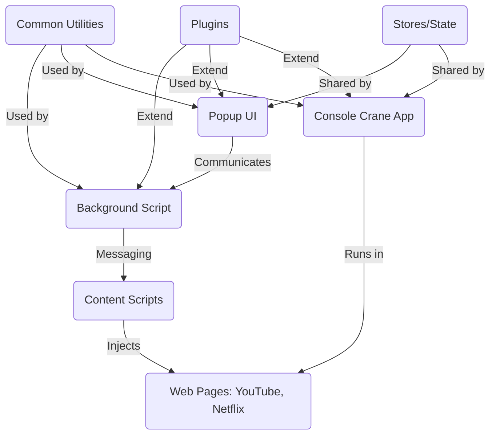

# Subturtle 
### would help you for learning English while you are watching a video on the internet. 

### You can do a lot with it:
- Translate words through hovering (moving the mouse pointer on them)
- Translate the whole subtitle to any language you want.
- See word detail containing definitions and part of speech.

🎁 [Download](https://chrome.google.com/webstore/detail/subturtle/gaplicnpaiidofkoeonioomcnadoofkf) from chrome webstore

---

<p align="center">

</p>

---

Supported websites:
- Youtube
- Netflix
- More websites will be supported soon.

Latest updates 

[ v1.6.2 ]:
- Added word bundles, users can save words in different categories to review later. 

[ v1.6.1 ]:
- Support multiple-word selection on subtitles, you can mark multiple words and see the translation.
- Added uninstall feedback form.

[ v1.1 ]:
- Added analytics.
- Added Guide description on extension popup.

---

<p align="center">


</p>

---

# Technical Documentation

## Table of Contents

- [Project Overview](#project-overview)
- [Architecture](#architecture)
  - [Main Modules](#main-modules)
  - [Data Flow](#data-flow)
- [Directory Structure](#directory-structure)
- [Key Components](#key-components)
  - [Background Scripts](#background-scripts)
  - [Popup UI](#popup-ui)
  - [Console Crane App](#console-crane-app)
  - [Subtitle Injection](#subtitle-injection)
  - [Common Utilities](#common-utilities)
  - [Plugins](#plugins)
  - [State Management](#state-management)
- [Services & Helpers](#services--helpers)
- [Types & Static Data](#types--static-data)
- [Extending the Extension](#extending-the-extension)
- [Build & Development](#build--development)
- [Manifest & Assets](#manifest--assets)

---

## Project Overview

Subturtle is a Chrome extension designed to help users learn English while watching videos online. It provides features such as word translation on hover, full subtitle translation, and detailed word information. The extension supports platforms like YouTube and Netflix, with plans for more.

---

## Architecture

### Main Modules

- **Background Scripts:** Handle background tasks, Chrome API interactions, and messaging.
- **Popup UI:** The extension popup, providing quick access to features and settings.
- **Console Crane App:** The main extension app rendered in a web page, with its own router and features such as word detail and (in the future) settings.
- **Subtitle Injection:** Injects and manages subtitles on supported video sites.
- **Common Utilities:** Shared helpers, services, icons, and types.
- **Plugins:** Integrations and additional features (e.g., Mixpanel analytics, modular REST).
- **State Management:** Centralized state for user data, settings, and app state.

### Data Flow

- User interacts with video page or popup.
- Content scripts inject subtitle features and communicate with background scripts.
- Background scripts handle API calls, storage, and messaging.
- Popup and Console Crane App interact with background and content scripts for real-time updates.

#### Mermaid Diagram: High-Level Architecture



---

## Directory Structure

```
src/
  background.ts
  main.ts
  popup.ts
  console-crane/
    router.ts
    types.ts
    components/
    stores/
    views/
  subtitle/
    _support-template/
    web_netflix/
    web_youtube/
    components/
    helpers/
  popup/
    App.vue
    router.ts
    components/
    helper/
    views/
  common/
    components/
    helper/
    icons/
    services/
    static/
    types/
  plugins/
    install.ts
    mixpanel.ts
    modular-rest.ts
    vue-prime/
  stores/
  animation.scss
  tailwind.css
  vue-shim.d.ts
```

---

## Key Components

### Background Scripts

- **File:** `src/background.ts`
- Handles Chrome extension background tasks, OAuth, window management, and messaging.

### Popup UI

- **Directory:** `src/popup/`
- Vue-based popup interface for quick access to extension features and settings.

### Console Crane App

- **Directory:** `src/console-crane/`
- The main extension app rendered in a web page.
- Features its own router (`router.ts`), views, and components.
- Provides advanced features like word detail and will support settings and more.

### Subtitle Injection

- **Directory:** `src/subtitle/`
- Injects and manages subtitles on supported sites (YouTube, Netflix).
- Contains site-specific logic and shared components.

### Common Utilities

- **Directory:** `src/common/`
- Shared helpers (text, math, promise, etc.), services (HTTP, translation), icons, static data, and TypeScript types.

### Plugins

- **Directory:** `src/plugins/`
- Integrations for analytics (Mixpanel), modular REST, and Vue plugin setup.

### State Management

- **Directories:** `src/stores/`, `src/console-crane/stores/`
- Centralized state for user data, word bundles, and app state.

---

## Services & Helpers

- **HTTP Service:** `src/common/services/http.service.ts` — Handles API requests.
- **Proxy Service:** `src/common/services/proxy.service.ts` — Manages proxying requests.
- **Router Observer:** `src/common/services/router-observer.service.ts` — Observes route changes.
- **Translate Service:** `src/common/services/translate.service.ts` — Manages translation logic.
- **Helpers:** Utilities for logging, text processing, math, promises, and more.

---

## Types & Static Data

- **Types:** `src/common/types/` — TypeScript types for API responses, general data, messaging, and phrases.
- **Static Data:** `src/common/static/` — Base64 images, global constants, supported languages.

---

## Extending the Extension

- To add support for a new website, create a new directory under `src/subtitle/` and implement the required components and logic.
- To add new features to the Console Crane App, add new views/components and update the router.

---

## Build & Development

- **Setup:** Install dependencies with `npm install`.
- **Development:** Use `npm run dev` to start the development server.
- **Build:** Use `npm run build` to create a production build.
- **Testing:** (Add details if tests exist.)

---

## Manifest & Assets

- **Manifest:** `static/manifest.json` — Chrome extension manifest configuration.
- **Assets:** `static/assets/`, `static/assets/style/`, `static/assets/svg/` — Images, styles, and SVGs used by the extension.

---
